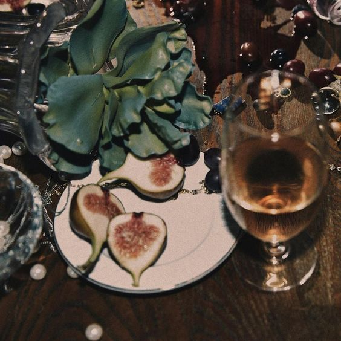

  

      <h1 class="title text-center">Discovery set</h1>

      <h3 class="subtitle text-center">
      If you've made it to this page, then you're one of the selected few people who've unlocked exclusive access to our pre-release discovery kit. 
      Our hand poured perfumes are exclusively available to pre-order.
      </h3>

      <a href="https://dor-olfactory.sumupstore.com" class="button" target="_blank" style="text-align: center;">Shop now</a>

      
&nbsp;

   

<section class="image-text-container">
  
  
 <b> Figure Me Out </b> Lorem ipsumorem ipsumorem ipsumorem ipsumorem ipsumorem ipsumorem ipsumorem ipsumorem ipsumorem ipsumorem ipsumorem ipsumorem ipsumorem ipsumorem ipsumorem ipsumorem ipsumorem ipsumorem ipsumorem ipsumorem ipsumorem ipsumorem ipsumorem ipsumorem ipsumorem ipsumorem ipsumorem ipsum

</section>

<section class="image-text-container flex-reverse">
  
  
 <b> Date with a Shaman </b>Lorem ipsumorem ipsumorem ipsumorem ipsumorem ipsumorem ipsumorem ipsumorem ipsumorem ipsumorem ipsumorem ipsumorem ipsumorem ipsumorem ipsumorem ipsumorem ipsumorem ipsumorem ipsumorem ipsumorem ipsumorem ipsumorem ipsumorem ipsumorem ipsumorem ipsumorem ipsumorem ipsumorem ipsum

</section>

<section class="image-text-container">
  
  
 <b> Legno sacro </b>Lorem ipsumorem ipsumorem ipsumorem ipsumorem ipsumorem ipsumorem ipsumorem ipsumorem ipsumorem ipsumorem ipsumorem ipsumorem ipsumorem ipsumorem ipsumorem ipsumorem ipsumorem ipsumorem ipsumorem ipsumorem ipsumorem ipsumorem ipsumorem ipsumorem ipsumorem ipsumorem ipsumorem ipsum

</section>

